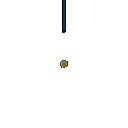

# Furby Connect SPR/CEL/PAL converter
A simple python project to convert Furby Connect's graphical assets to PNGs and/or GIFs





## Extracted assets **for _all_ six personalities** (Base, Cat, DJ, Ninja, Pirate, PopStar, Princess) are in the out folder!

| Personality | Animations |
|:------------|:-----------|
| Base        | 1256       |
| Cat         | 72         |
| DJ          | 80         |
| Ninja       | 64         |
| Pirate      | 120        |
| Popstar     | 80         |
| Princess    | 72         |

I think the reason all personalities other from Base have so little animations is that they don't repeat all the base's animations in a different color, but rather just change the palette in runtime to save space.

This means that _anim_0001_ of every personality except the Base one is the eye color

<details>
    <summary>Things for developers</summary>

If you want to use this script, install numpy, tqdm and Pillow using `pip install numpy tqdm Pillow`

```
usage: main.py [-h] [--circle-mask | --no-circle-mask] [--frames |
               --no-frames] [--videos | --no-videos] [--anim-dump-count N]
               folders [folders ...]
```

Everything should be straight-forward

For example, 
`python main.py Base Cat DJ Ninja Pirate PopStar Princess --no-circle-mask --videos --frames`
will dump videos (GIFs) and frames (BMPs) from all the Personalities (assuming you have those folders from [this](https://github.com/Furby-ReConnect/Furby)/Furby-Files/Personalities) without circle eye mask.
</details>

### Huge thanks to
- https://github.com/Furby-ReConnect/Furby -- Furby files extracted from NAND dump
- https://github.com/micheal65536/furbhax -- Furby Connect FTL reverse engineering
- https://github.com/swarley7/furbhax -- Initial and the only Furby Connect NAND dump on the internet
- https://github.com/ctxis/Furby -- Original Furby repository, this code just uses its algorithms to parse standalone CEL, SPR and PAL files instead of sections in DLC and also saves them to GIFs

_Furby and all of extracted files are the property of Hasbro. The author of this repository does not own these assets. This tool is non-commercial and fan-made._